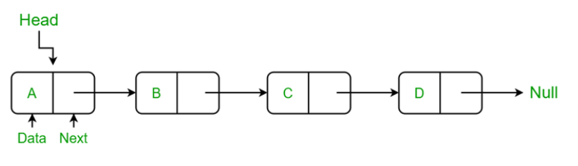
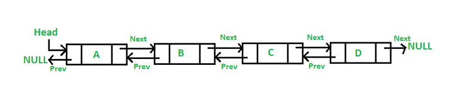
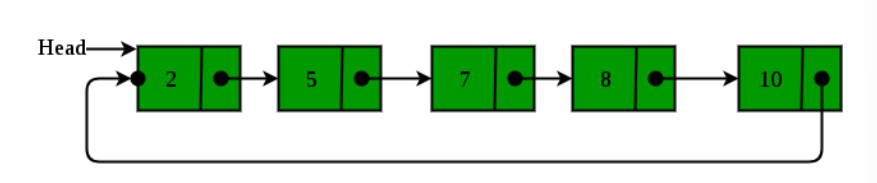
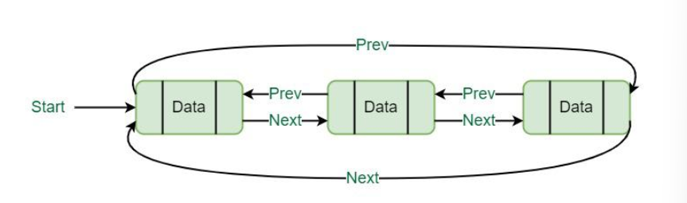

## Linked List

A linked list allocates space for each element separately in a block of memory
called “node". The list gets an overall structure by using pointers to connect all
its nodes together like the links in a chain. Each node contains two fields; a
"data" field to store whatever element, and a "link" field which is a pointer used
to link to the link node. 

### **Types of Linked List:**

**1) Singly linked list:**
A linked list with a node that contains one data field and one link field which contains the address of the next node

**2) Doubly linked list:**
A linked list with a node that contains one data field and two link fields, one which contains the address of the next node and one which contains the address of the previous node

**3) Singly Circular linked list:**
A singly linked list where the last node in the list connects back to the first node to form a circle

**4) Doubly Circular linked list:**
A doubly linked list where the last node in the list connects back to the first node to form a circle

Credits for all images to [Geeks for geeks](https://www.geeksforgeeks.org/data-structures/linked-list/)