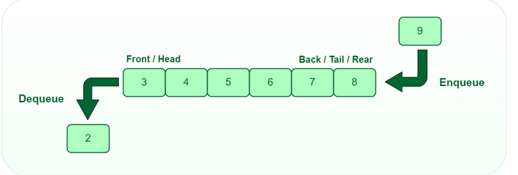

## Queue

A Queue is a linear data structure, where all the insertion happens in the rear and deletion happens in the front. Hence it is called a FIFO(First in, First out) data structure.

### **There are four major operations that are performed on Queue:**

**1) Enqueue:**
Enqueues(Inserts) an element to the rear of the Queue.

**2) Pop:**
Dequeues(deletes) an element from the front of the Queue. Returns Underflow, if queue is empty.

**3) Peek:**
Returns the ***Value*** of the element in the front of the Queue. ***Does not return its index postition***. Returns Underflow, if list is empty.

**4) Display:**
Displays the Queue from front to rear.

### **Types of Queues:**

- Ordinary Queue
- Circular Queue
- Double ended Queue
- Priority Queue

### **Application of Queues:**

- Josephus Problem
- CPU Scheduling
- Music queue in a music player
- Printing queue in a printer

[Note: The applications have not been uploaded]

### **Now in C, we can implement queue mainly using 2 methods:**

- Linked list implementation
- Array Implementation

Image Courtesy: [Geeks for geeks](https://www.geeksforgeeks.org/queue-data-structure/)