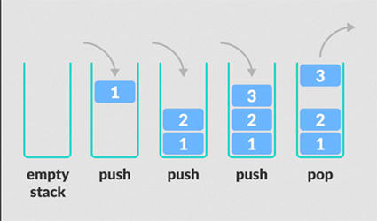

## Stack

A Stack is a linear data structure, where all the insertion and deletion of elements happen at one end. Hence it is called a LIFO(Last in, First out) data structure.

### **There are four major operations that are performed on stack:**

**1) Push:**
Pushes(Inserts) an element on top of the stack.

**2) Pop:**
Pops(Deletes) the topmost element of the stack. Returns Underflow, if Stack is empty.

**3) Peek:**
Returns the ***Value*** of the topmost element of the stack. ***Does not return its index postition***. Returns Underflow, if list is empty.

**4) Display:**
Displays the stack from top to down order.

### **Application of stacks:**

- **[MOST IMPORTANT] Recursion**
- Infix to postfix conversion
- Infix to prefix conversion
- Conversion of prefix/postfix to infix
- Tower of Hanoi problems

[Note: The applications have not been uploaded]

### **Now in C, we can implement stack mainly using 2 methods:**

- Linked list implementation
- Array Implementation

We have shown both the implementations in the codes above

Image Courtesy: [Programiz.com](https://www.programiz.com/dsa/stack)