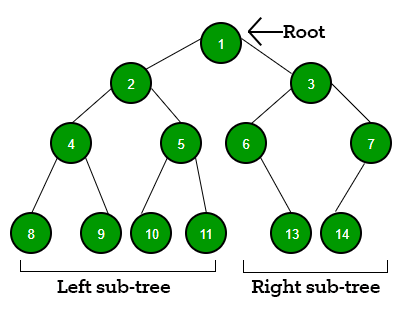

## Binary Trees

A Binary Tree is a non linear data structure.
It is a finite set of elements that is either empty or is partitioned into three subsets:

1) A single element called **Root**
2) A binary tree, called the left binary tree
3) A binary tree, called the right binary tree

### **We will be looking into Binary Search Trees**

is a Binary tree that is either empty or in which every node contains a
key and satisfies the conditions:
- The key in the left side of a child (if it exists) is less than the key in the parent node
- The key in the right side of a child (if it exists) is greater than the key in the parent
node
- The left and right subtrees of the root are again binary search trees

Image Courtesy: [Geeks for geeks](https://www.geeksforgeeks.org/data-structures/binary-tree-data-structure/)