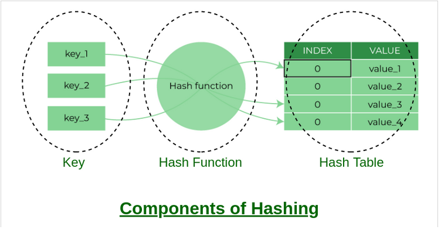

# Hash Table

## Hashing

Hashing is the process of transforming any given key into another value.

The most popular use for hashing is the implementation of hash tables.

A hash table stores key and value pairs in a list that is accessible through its index. Here, we calculate the index using modulo by table size.

## Collision:

Collision is a phenomenon where two keys generate the same hash value.

Collision can be handled by two methods:

- **Open Addressing(Closed Hashing):** Open addressing handles collisions by storing all data in the hash table itself and then seeking out availability in the next spot created by the algorithm.

    Algorithms used:
    
    - Linear Probing
    - Quadratic Probing
    - Double Hasing
- **Separate Chaining(Open Hashing):** Separate chaining handles collision by making every hash table cell point to linked lists of records with identical hash function values.

### **Hash table using Dictionary in python:**
DIctionary is a collection of ordered, Key: Value pairs which is essentially a hash table. We have the implementation of Hash table using dictionary [here](https://github.com/crazydj8/DataStructures/blob/main/Python/Hashing/dictionaryhash.py). 

### **Extra Python modules used:**
- **Numpy:** Numpy module was used for creation of the arrays
- **Importlib:** to import a user created module from any location within the system

If Numpy module is not installed, make sure pip is installed, go to the terminal and type:

        pip install numpy

Image Courtesy: [Geeks for Geeks](https://www.geeksforgeeks.org/hashing-data-structure/)