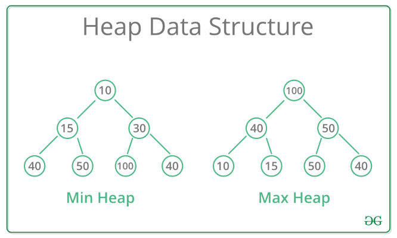

## Heaps

A Heap can be defined as a Binary Tree with keys assigned to its node and provided that the following conditions are met:

1) **The tree's shape requirement:** The Binary Tree must be a complete binary tree. i.e. All the levels must be completely filled except the last level, which can be full, or have all the nodes on the far left side.
2) - **The Max Heap requirement:** The key of each node must be greater than or equal to the key of its children
    - **The Min Heap requirement:** The key of each node must be smaller than or equal to the key of its children

### **Applications - Priority Queues**:    
- **Ascending Priority queue:** Min heap
- **Descending Priority queue:** Max heap

### **Extra Python modules used:**
- **Numpy:** Numpy module was used for creation of the heap array

If Numpy module is not installed, make sure pip is installed, go to the terminal and type:

        pip install numpy

Image Courtesy: [Geeks for geeks](https://www.geeksforgeeks.org/data-structures/heap-data-structure/)